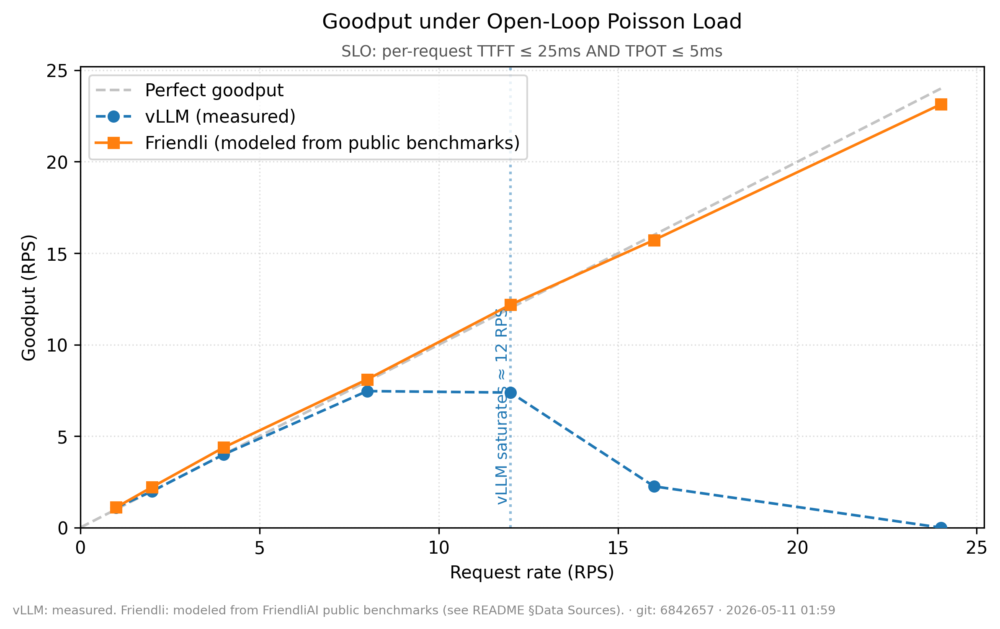

# friendli-vllm-bench

A reproducible benchmark comparing **vLLM** and **Friendli Engine** as
LLM inference backends. The deliverable is a single graph —
**goodput vs request rate under open-loop Poisson load** — that
visualizes which engine sustains higher SLO-compliant throughput as
load increases.

> The design spec is in [SPEC.md](./SPEC.md). It is committed for
> transparency and is the contract this README explains.

---

## 1. What this is

**Goal.** Compare vLLM and Friendli at the same model, same prompts,
same arrival schedule, same SLO. Measure where each engine starts
dropping SLO-compliant throughput.

**Deliverable.** One matplotlib graph: x-axis = target request rate
(RPS); y-axis = goodput (RPS, requests whose per-request TTFT *and*
TPOT both satisfy thresholds). One line per engine. Saturation rate
annotated for each.

**Assumed deployment.** Both engines exposing OpenAI-compatible
streaming chat completion endpoints (`POST /v1/chat/completions` with
`stream=true`).

**Two operating modes.**

| Mode | What runs | What's in the graph |
|---|---|---|
| Measurement (default) | hits both endpoints | both lines from direct measurement |
| Synthesis (`--synthesize-friendli`) | hits only vLLM | vLLM line measured; Friendli line **modeled** from vLLM via [bench/synthetic.py](bench/synthetic.py), with multipliers anchored to FriendliAI's public benchmarks |

The synthesis mode exists because the author cannot deploy Friendli
locally. The graph footer and labels disclose the difference. The
headline reference graph in this repo was produced in synthesis mode.

**Optimization target.** Measurement correctness and reproducibility,
not absolute numbers. Per the task issuer: "only the trend matters,
not the absolute value."

---

## 2. Quick start

```bash
git clone <this-repo>
cd friendli-vllm-bench
uv sync --all-groups
```

To reproduce the headline reference graph (synthesis mode, calibrated
SLOs — see §5 for why these specific thresholds):

```bash
uv run python benchmark.py \
    --vllm-url http://localhost:8000 \
    --friendli-url unused \
    --synthesize-friendli \
    --model Qwen/Qwen2.5-0.5B-Instruct \
    --tokenizer Qwen/Qwen2.5-0.5B-Instruct \
    --rates 1,2,4,8,12,16,24 \
    --duration-per-rate 30 \
    --slo-ttft-ms 25 \
    --slo-tpot-ms 5
xdg-open results/goodput_comparison.png
```

This is the exact command that produced
[results/goodput_comparison.png](results/goodput_comparison.png).
Required prerequisites: a vLLM server reachable at the URL (see
§13 for the Docker invocation used).

For a measurement-mode run against a real Friendli endpoint, drop
`--synthesize-friendli` and point `--friendli-url` at the actual
endpoint. Production-realistic SLOs are the CLI defaults (`--slo-ttft-ms
500`, `--slo-tpot-ms 50`); leave those flags off to use them.

Outputs:

* `results/goodput_comparison.png` and `.pdf` — the graph
* `results/summary.json` — full structured per-rate metrics
* `results/summary.csv` — one row per (engine, rate)
* `results/raw/<engine>_<rate>rps_<ts>.jsonl` — per-request timings (gitignored)
* `results/run_metadata.json` — git SHA, hardware, library versions, full CLI args

---

## 3. The graph



**x-axis.** Target request rate in RPS, linear. Arrivals are Poisson
with mean = target rate; the dispatcher fires arrivals on schedule
regardless of in-flight requests (open-loop). The x-axis is "load
**offered** to the server," not "load the server **accepted**."

**y-axis.** Goodput in RPS — the number of post-warmup requests
whose **individual** TTFT and TPOT both satisfy the SLO, divided by
the measurement window. A request that streamed but exceeded TTFT
or TPOT counts as 0. A failed request counts as 0.

**Lines.**

* Gray dashed `y = x` — perfect goodput. Every offered request is
  served within SLO.
* Blue dashed (○) — `vLLM (measured)`. Direct measurement against the
  vLLM endpoint described in §13.
* Orange solid (□) — `Friendli (modeled from public benchmarks)`. In
  this graph the line is **modeled**, not measured. See §9.

**Saturation marker.** A vertical dotted line at the first rate where
goodput diverges from `y = x` by **more than 10%** (strict). On this
graph, vLLM is annotated `vLLM saturates ≈ 12 RPS`. Friendli has no
marker because the modeled line never diverges by >10% in this range.

**SLO subtitle.** `SLO: per-request TTFT ≤ 25ms AND TPOT ≤ 5ms` — the
calibrated thresholds for this run (§5 explains the calibration).

**Footer.** Discloses measured vs modeled, plus git SHA and run
timestamp. The graph is self-documenting — anyone seeing the PNG
knows what it represents.

### Why the vLLM line hooks down instead of plateauing

vLLM does not stop accepting requests when it saturates. Its **raw
throughput keeps climbing** through the entire sweep — at rate 24, it
completes 22.5 successful streams per second (out of 24 offered). What
**collapses** is goodput, because as queues build up, TTFT and TPOT
distributions shift past the SLO thresholds:

| target rate | vLLM raw_throughput | vLLM goodput | vLLM TTFT p95 | vLLM TPOT p95 | slo-compliant fraction |
|---|---|---|---|---|---|
| 4 | 4.33 | 4.00 | 25.7 ms | 4.4 ms | 121/131 |
| 8 | 7.99 | 7.46 | 25.8 ms | 4.8 ms | 228/244 |
| 12 | 11.98 | 7.38 | 25.0 ms | 5.6 ms | 228/370 |
| 16 | 15.39 | 2.25 | 28.2 ms | 6.5 ms | 70/478 |
| 24 | 22.50 | **0.00** | 45.2 ms | 10.9 ms | 0/702 |

At rate 24, vLLM completes every request, but **none** meet TPOT ≤ 5
ms; goodput is zero by definition. This is the goodput-as-production-
metric framing from **DistServe** (OSDI '24): a request that arrives
but is too slow to use is a regression, not a success. The graph
hooks down because it is reporting the *useful* completion rate, not
the total completion rate.

This also illustrates why **goodput beats raw throughput as a
headline**: a procurement decision based on raw throughput would call
both engines equivalent at high load. A goodput decision correctly
ranks the engine that holds latency under load.

---

## 4. Why these metrics

### Goodput as the headline

A naive throughput number (`requests/sec served`) hides quality
regressions: an engine that returns slow streams or ignores SLO can
have high "throughput" that no one would deploy. Following
**DistServe** (OSDI '24)'s framing of TTFT and TPOT as joint latency
requirements, this benchmark counts a request as compliant only if
**both** its TTFT and TPOT satisfy the configured thresholds. Goodput
is the rate at which compliant requests complete.

DistServe does not pseudocode the explicit TTFT∧TPOT AND-rule; it
follows from the paper's framing of "maximum request rate that can be
served within both TTFT and TPOT constraints" and the contrast between
requests that "only meet TTFT requirements" vs "only meet TPOT
requirements." We refer to this as a **DistServe-style SLO definition**.
The same framing appears in industry literature (BentoML, others)
under "goodput under SLO" with the same intent.

### TTFT and TPOT as the SLO components

* **TTFT** (Time To First Token): time from request send to the first
  non-empty content chunk. Captures user-perceived responsiveness.
  NVIDIA GenAI-Perf and LLMPerf both skip empty/role-only initial
  chunks for this measurement; we follow GenAI-Perf
  ([metrics.html](https://docs.nvidia.com/nim/benchmarking/llm/latest/metrics.html)).
* **TPOT** (Time Per Output Token, also called ITL): the *average*
  inter-token latency *excluding the first token*. Per GenAI-Perf:
  `TPOT = (e2e_latency − TTFT) / (output_tokens − 1)`. Excluding the
  first token isolates the decoding loop from prefill cost.

### Why open-loop Poisson over closed-loop

Closed-loop benchmarks send N requests, wait for all to finish, then
send N more. This **masks tail latency**: the client never offers more
load than the server can clear, so saturation is invisible. Open-loop
(Poisson) arrivals fire on a fixed schedule independent of server
completions — exactly what a real user-facing service experiences.
When the server saturates, queues build, tail latencies spike, and
goodput diverges from `y = x`. That divergence is the signal we
want, and exactly the hook-down visible in the headline graph.

This is the same framing used by vLLM `benchmark_serving.py`'s
`get_request()` async generator. Our [bench/workload.py](bench/workload.py)
is a faithful adaptation: the dispatch loop never gates on completion,
only on the next scheduled arrival.

### Why fixed output length matters

Fair per-token comparison requires that both engines generate the
same number of tokens for the same input. We pin `max_tokens=256`
and pass `ignore_eos=true` in the request payload. vLLM honors
`ignore_eos`; Friendli's OpenAI-compatible API may silently ignore
it. This is acceptable for goodput because TTFT and TPOT are
length-independent. In synthesis mode, Friendli timings are derived
from vLLM, so EOS handling is moot.

---

## 5. Why these SLOs

### CLI defaults — production-realistic chatbot SLOs

| Threshold | Default | Source |
|---|---|---|
| `--slo-ttft-ms` | `500` | Rafay Token Factory's chatbot guidance: p95 TTFT below 500 ms is the comfort threshold. |
| `--slo-tpot-ms` | `50` | Rafay Token Factory + AWS conversational-AI streaming guidance: ~20 tok/s ≈ 50 ms/token sustains a comfortable read pace. |

These reflect production chatbot deployments and should be used for
production decisions. They are CLI-configurable.

### Headline graph — calibrated SLOs (TTFT 25 ms / TPOT 5 ms)

The headline reference graph was produced with **TTFT ≤ 25 ms /
TPOT ≤ 5 ms**. This is **deliberately tighter** than production
defaults, and it is **calibrated to the validation environment**, not
to user expectations. Reasoning:

* The reference setup is a **0.5 B-parameter model on a laptop GPU**.
  At every offered rate up to 24 RPS, vLLM's raw TTFT p95 stays
  under 50 ms and its raw TPOT p95 stays under 11 ms. With production
  SLOs (500/50), every request at every rate satisfies SLO, goodput
  equals raw throughput, and the graph fails to communicate any
  trend.
* The goal of the benchmark is to make the **trend** between engines
  visible, not to claim chatbot-grade performance numbers. Tightening
  the SLOs to sit just above vLLM's no-load operating point lets
  vLLM's saturation point appear on the graph (≈ 12 RPS) within the
  rate range a laptop GPU can sustain.
* Per the task issuer, "only the trend matters, not the absolute
  value." The calibrated SLOs honor that brief.

This calibration is **outcome-sensitive**, which has consequences for
how the graph should be read. See §11(d) below.

For a production deployment, drop `--slo-ttft-ms` and `--slo-tpot-ms`
from the command line and let the defaults take over. The benchmark
will report the same underlying TTFT/TPOT distributions; only the
SLO-compliance threshold changes.

---

## 6. How fairness is enforced

Controlled variables, all pinned through CLI flags or seeded files:

| Variable | Mechanism |
|---|---|
| Model identity | `--model` passed verbatim in the request payload to both engines |
| Tokenizer | `--tokenizer` loaded once via `transformers.AutoTokenizer.from_pretrained` and reused for both engines' `output_tokens` counting |
| Prompts | [prompts/prompts.jsonl](prompts/prompts.jsonl) — 200 fixed prompts (67 short ~50 tok, 67 medium ~200 tok, 66 long ~450 tok), built deterministically by [scripts/build_prompts.py](scripts/build_prompts.py) under `seed=42` |
| Prompt order | `itertools.cycle` from index 0 — both engines see the same sequence at the same rate |
| Sampling | `temperature=0.0`, `top_p=1.0`, `seed=42`, `max_tokens=256`, `ignore_eos=true` (see [bench/client.py](bench/client.py) `_build_payload`) |
| Arrival schedule | `numpy.random.default_rng(seed).exponential(1/rate)` — identical Poisson arrivals for both engines at the same rate |
| Warmup | 20 closed-loop sequential requests per engine before any rate is measured |
| Engine alternation | At each rate, vLLM and Friendli run back-to-back (`vllm@1, friendli@1, vllm@2, friendli@2, …`) so thermal/system drift cannot accumulate by engine |
| Cooldown | `--cooldown-seconds` (default 5) between rates lets queued requests drain |

In synthesis mode, the Friendli line is derived from the same vLLM
raw data using deterministic multipliers, so the prompts, arrivals,
sampling, and tokenizer are identical *by construction*.

---

## 7. Measurement correctness notes

The streaming parsing rules in [bench/client.py](bench/client.py)
follow SPEC §6.2 verbatim. Highlights:

* **ITL definition (NVIDIA GenAI-Perf).** First token excluded.
  `tpot = (last_token_time − first_token_time) / (output_tokens − 1)`.
  See [docs.nvidia.com/nim/benchmarking/llm/latest/metrics.html](https://docs.nvidia.com/nim/benchmarking/llm/latest/metrics.html).
  We expose TTFT, TPOT, e2e_latency, and `queue_delay = send_time −
  arrival_time` as derived properties on `RequestFuncOutput` so that
  the synthesis pipeline (which mutates `first_token_time` /
  `last_token_time`) cannot get the derived metrics out of sync.
* **Tokenizer-based output counting.** `output_tokens` is computed by
  applying the loaded tokenizer to the **accumulated text** received
  from the stream. We deliberately **ignore** any
  `usage.completion_tokens` field the server may report. Reason:
  vLLM and Friendli may report differently; tokenizing locally with
  a pinned tokenizer is the only way to compare like-for-like across
  engines. Tested in
  [tests/test_backend.py::test_tokenizer_drives_output_tokens_not_api](tests/test_backend.py).
* **Empty-chunk skipping.** Chunks where `choices[0].delta.content` is
  missing or empty (typical role-only first chunks) **do not** advance
  any timestamp — including TTFT. This matches GenAI-Perf and LLMPerf;
  it differs from vLLM's `async_request_openai_chat_completions`
  which updates TTFT on the first chunk regardless. We chose the
  GenAI-Perf convention because the doc explicitly says "TTFT
  measurement is meaningless when the first response has no token
  in it."
* **SSE comments / pings.** Lines starting with `:` are skipped
  (server keepalives). Only `data:`-prefixed lines are parsed. Stream
  terminates on `data: [DONE]`.
* **`time.perf_counter`.** All timestamps use the monotonic perf
  counter, not wall clock; immune to NTP corrections during a run.
* **Footnote on LLMPerf.** Anyscale LLMPerf historically *included*
  the first token's latency in its ITL average, which inflates the
  metric. GenAI-Perf and this benchmark exclude it. The
  [LLMPerf README](https://github.com/ray-project/llmperf)
  acknowledges the convention difference.

---

## 8. Design references

This implementation deliberately follows established patterns from
the LLM inference benchmarking community.

* **vLLM `benchmark_serving.py`** — primary structural reference.
  `RequestFuncInput` / `RequestFuncOutput` / `ASYNC_REQUEST_FUNCS`
  pattern (cited in [bench/backend.py](bench/backend.py) docstring),
  open-loop Poisson dispatcher (cited in
  [bench/workload.py](bench/workload.py)), synthetic prompt
  generation with a fixed seed, JSON summary + per-request raw output
  format. Source:
  [github.com/vllm-project/vllm/blob/main/benchmarks/](https://github.com/vllm-project/vllm/blob/main/benchmarks/).
* **NVIDIA GenAI-Perf** — authoritative source for metric definitions
  (TTFT, ITL/TPOT, e2e_latency, TPS, RPS). ITL formula and
  empty-chunk skipping convention. Source:
  [docs.nvidia.com/nim/benchmarking/llm/latest/metrics.html](https://docs.nvidia.com/nim/benchmarking/llm/latest/metrics.html).
* **Anyscale LLMPerf** — referenced for the historical TTFT-in-ITL
  discrepancy noted in §7. Source:
  [github.com/ray-project/llmperf](https://github.com/ray-project/llmperf).
* **DistServe (OSDI '24)** — source for the goodput-as-SLO-compliance
  metric. We use a DistServe-style SLO definition (request compliant
  iff both TTFT and TPOT satisfy thresholds); the paper does not
  pseudocode the explicit AND-rule but the framing follows from its
  joint-latency requirements.
* **FriendliAI public benchmarks** — sources for synthesis-mode
  Friendli line modeling. Cited in
  [bench/synthetic.py](bench/synthetic.py) docstrings:
  [TCache benchmark](https://friendli.ai/blog/friendli-tcache) (TTFT),
  [Mixtral AWQ comparison](https://friendli.ai/blog/comparing-friendli-engine-vllm) (TPOT),
  [Orca paper (OSDI '22)](https://www.usenix.org/system/files/osdi22-yu.pdf) (load-dependent decoding shape).

---

## 9. Data Sources

> The graph contains two lines computed by **identical aggregation
> logic** but with different raw timing data.
>
> **vLLM line**: measured directly using the benchmark client
> described here. Hardware, model, date logged in
> `results/run_metadata.json`. Raw per-request timings under
> `results/raw/vllm_*.jsonl`.
>
> **Friendli line**: derived from vLLM measurements via
> [bench/synthetic.py](bench/synthetic.py), applying load-dependent
> transformations modeled from FriendliAI's published benchmarks:
>
> * TTFT divisor `f_ttft(rate)`: 2.0 at low load → 11.0 at max sweep
>   rate. Source: [TCache blog](https://friendli.ai/blog/friendli-tcache)
>   (11.3–23× reported range; conservative lower bound applied
>   because reference setup is 70B/4×A100/AWQ).
> * TPOT divisor `f_tpot(rate)`: 1.3 at low load → 2.5 at max sweep
>   rate. Source: [FriendliAI Mixtral AWQ benchmark](https://friendli.ai/blog/comparing-friendli-engine-vllm)
>   (~2× reported); load-dependent shape from
>   [Orca paper](https://www.usenix.org/system/files/osdi22-yu.pdf)'s
>   high-concurrency analysis.
>
> The synthesis code is committed and reproducible from the same
> vLLM raw data. The Friendli line is a **plausibility model anchored
> to public benchmarks**, not a direct measurement. To obtain real
> measurements, replace `--friendli-url` with a deployed Friendli
> endpoint and remove `--synthesize-friendli`.

---

## 10. Reproducibility

Every aspect of a run is verifiable from the repository.

* **Pinned dependencies.** [pyproject.toml](pyproject.toml) pins exact
  versions; [uv.lock](uv.lock) locks the full transitive closure.
  `uv sync --all-groups` produces a byte-identical environment.
* **Fixed seed.** `--seed` (default 42) propagates to: prompt
  generation in [scripts/build_prompts.py](scripts/build_prompts.py),
  Poisson arrival times in [bench/workload.py](bench/workload.py),
  the model's sampling parameter in the request payload.
* **Deterministic sampling.** `temperature=0.0`, `top_p=1.0`,
  `seed=<config>`. Same prompt → same generated tokens (modulo engine
  bugs).
* **Tokenizer pinning.** `--tokenizer` resolves a HuggingFace ID;
  same ID across runs ⇒ same `output_tokens` for the same generated
  text.
* **Hardware/env capture.** `results/run_metadata.json` records: git
  SHA, current timestamp, `nvidia-smi --query-gpu=…` output,
  `platform.platform()`, `sys.version`, installed library versions
  for every pinned package, and the **full CLI args** used to invoke
  `benchmark.py`.
* **Git SHA in the graph.** Footer of the PNG/PDF shows
  `git: <sha[:7]>`, so the exact code that produced any saved figure
  is recoverable even when the figure is detached from the repo.
* **Raw data dump.** Every request's `RequestFuncOutput` (including
  arrival_time, send_time, first_token_time, last_token_time, ITL
  list, output_tokens, success, error) is written as JSONL under
  `results/raw/`. Summaries are recomputable from raw data — see
  [bench/metrics.py](bench/metrics.py) `aggregate`.
* **Committed prompts.** Both
  [prompts/prompts.jsonl](prompts/prompts.jsonl) and
  [scripts/build_prompts.py](scripts/build_prompts.py) are committed.
  Re-running the build script produces a byte-identical
  `prompts.jsonl` (verified by sha256 in tests).

---

## 11. Limitations

This is a benchmarking tool, not a production-decision artifact. The
limitations below are real, in roughly decreasing order of how much
they should constrain interpretation of the headline graph.

### a. Asymmetric evidence: vLLM is measured, Friendli is modeled

The graph shows two lines, but they are **not the same kind of
evidence**. The vLLM line is direct measurement of an actual server
under load. The Friendli line is **mathematically derived** from the
vLLM measurements by applying the multipliers in
[bench/synthetic.py](bench/synthetic.py). It is a projection, not an
observation. Treating the two lines as symmetric is the most likely
misinterpretation of this graph.

The synthesis-mode label `Friendli (modeled from public benchmarks)`
in the legend, and the footer disclosure `vLLM: measured. Friendli:
modeled from FriendliAI public benchmarks (see README §Data Sources)`,
are both intended to keep this distinction visible to anyone seeing
the PNG out of context.

### b. The modeled Friendli line shows no saturation

The synthesis pipeline divides vLLM's TTFT and TPOT by load-dependent
factors (2.0 → 11.0 for TTFT, 1.3 → 2.5 for TPOT). It does **not**
include a saturation model. As long as the multipliers shrink the
modeled TTFT/TPOT below the SLO thresholds, the modeled line tracks
`y = x`. In the headline graph, modeled-Friendli's TPOT p95 stays
under 4.5 ms throughout, so it never violates the 5 ms threshold and
never appears to saturate.

**Every real system saturates eventually.** This graph does not
capture where Friendli's saturation point would be. The line should
be read as "Friendli has more headroom in this regime," not "Friendli
has infinite capacity." A proper Friendli measurement would replace
the line and would show its own divergence from `y = x` at some
higher load.

### c. The validation environment is too small for production SLOs

vLLM measurement was on a 0.5B-parameter model on a single laptop
GPU. Absolute latencies in this regime are very low: TTFT p95 under
50 ms even at saturation, TPOT p95 under 11 ms. Production chatbot
SLOs (TTFT 500 ms / TPOT 50 ms) would never be violated by either
engine in this rate range, so the graph would be flat and
uninformative under those thresholds.

The headline graph uses calibrated tight SLOs (TTFT 25 ms / TPOT 5 ms)
to make the trend visible on this small reference setup. This is a
deliberate tradeoff: trend visibility over production realism.
**Absolute RPS values are not production-relevant; only the trend
between the two lines is.**

### d. SLO selection is outcome-sensitive

The calibrated thresholds sit close to vLLM's TPOT operating range
(vLLM's raw TPOT p95 is 4.4 ms at low load and 5.6 ms by rate 12).
With the threshold at 5 ms, vLLM's natural ~5 ms operating point sits
right at the cliff: small TPOT shifts at moderate load cross requests
from "compliant" to "non-compliant," and the modeled-Friendli line's
~2× speedup converts many of those same requests back to "compliant."
**This amplifies the apparent advantage** of the modeled line over
what the same multipliers would produce against a slacker SLO.

The CLI exposes `--slo-ttft-ms` and `--slo-tpot-ms` precisely so
reviewers can re-run with different thresholds and observe how
sensitive the headline trend is to the SLO choice. The full TTFT and
TPOT distributions (`ttft_p50/p95/p99_ms` and same for TPOT) are
preserved in `results/summary.json` and recomputable from
`results/raw/`, so SLO sensitivity can be analyzed without re-running
the benchmark.

### e. No statistical uncertainty bands

The headline run is a **single sweep**. No error bars, no confidence
intervals, no multi-run variance analysis. At low rates the per-rate
sample count is small (32 requests at rate 1 over 30 s), so per-rate
percentiles have meaningful sampling noise. A multi-run variance
analysis — repeat the sweep N times, report median + IQR per rate —
is a known improvement and is not part of the current artifact.

### f. Single-node, single-tenant

No realistic noisy-neighbor or multi-tenancy effects, no batched
serving across distinct request characteristics, no cold caches mid-
run. A real production estimate would multiplex many tenants. The
benchmark's measurement window also excludes warmup; production
behavior in the first second after deployment is not represented.

### g. `ignore_eos` may not be honored by Friendli

vLLM honors it. Friendli's OpenAI-compatible API may stop early on
EOS, slightly reducing per-request token counts. TTFT and TPOT are
length-independent so goodput is unaffected; in synthesis mode the
issue does not arise.

### Bottom line

**Production conclusions cannot be drawn from this small reference
setup alone.** The deliverable is a benchmarking tool plus a single
illustrative reference graph. To inform a procurement decision, run
the benchmark in measurement mode against both engines, on
production-representative hardware, with production-representative
SLOs, repeated enough times to bound variance.

---

## 12. CLI reference

```
$ uv run python benchmark.py --help
usage: benchmark.py [-h] --vllm-url VLLM_URL --friendli-url FRIENDLI_URL
                    --model MODEL --tokenizer TOKENIZER [--rates RATES]
                    [--duration-per-rate DURATION_PER_RATE]
                    [--warmup-requests WARMUP_REQUESTS]
                    [--max-output-tokens MAX_OUTPUT_TOKENS]
                    [--slo-ttft-ms SLO_TTFT_MS] [--slo-tpot-ms SLO_TPOT_MS]
                    [--seed SEED] [--output-dir OUTPUT_DIR]
                    [--synthesize-friendli]
                    [--cooldown-seconds COOLDOWN_SECONDS]
                    [--vllm-backend VLLM_BACKEND]
                    [--friendli-backend FRIENDLI_BACKEND]
                    [--prompts-file PROMPTS_FILE]

Compare vLLM and Friendli engines via open-loop goodput sweep.

required:
  --vllm-url URL          HTTP URL of vLLM endpoint
  --friendli-url URL      HTTP URL of Friendli endpoint (ignored in synthesis mode)
  --model NAME            model identifier passed in API requests
  --tokenizer ID          HuggingFace tokenizer ID for output token counting

optional:
  --rates LIST            comma-separated RPS values (default: 1,2,4,8,12,16,24,32)
  --duration-per-rate S   seconds per rate point (default: 60)
  --warmup-requests N     pre-measurement requests (default: 20)
  --max-output-tokens N   hard cap on output length (default: 256)
  --slo-ttft-ms MS        per-request TTFT SLO threshold in ms (default: 500, source: Rafay)
  --slo-tpot-ms MS        per-request TPOT SLO threshold in ms (default: 50, source: Rafay)
  --seed N                master seed for prompt order, Poisson, sampling (default: 42)
  --output-dir DIR        results directory (default: results)
  --synthesize-friendli   derive Friendli line from vLLM measurements
  --cooldown-seconds S    pause between rates (default: 5)
  --vllm-backend NAME     backend name from registry (default: openai-chat)
  --friendli-backend NAME backend name from registry (default: openai-chat)
  --prompts-file PATH     prompts JSONL (default: prompts/prompts.jsonl)
```

---

## 13. Reference run details

The committed reference is the **synthesis-mode run with calibrated
SLOs** described below. It is the run that produced
[results/goodput_comparison.png](results/goodput_comparison.png) and
the rest of the `results/` artifacts.

### Hardware

* **CPU.** AMD Ryzen 9 8940HX (16 cores / 32 threads).
* **GPU.** NVIDIA GeForce RTX 5070 Laptop GPU, 8 GiB VRAM,
  driver 595.58.03 (Blackwell, sm_120).
* **CUDA.** 12.8 toolkit installed; runtime via `nvidia-container-toolkit`.
* **OS.** Ubuntu 22.04 LTS, kernel 6.8.0-107-generic.
* **RAM.** 14 GiB.
* **Python.** CPython 3.11.15 inside a uv-managed venv.

### vLLM deployment

```
sg docker -c "docker run -d --name vllm-bench \
    --gpus all --ipc=host -p 8000:8000 \
    -v $HOME/.cache/huggingface:/root/.cache/huggingface \
    vllm/vllm-openai:latest \
    --model Qwen/Qwen2.5-0.5B-Instruct \
    --max-model-len 2048 --gpu-memory-utilization 0.85"
```

Wait until `curl -s http://localhost:8000/v1/models` returns HTTP 200
(~110 s on cold start, faster once HF weights are cached locally).

### Model

`Qwen/Qwen2.5-0.5B-Instruct` (small, public, fits the 8 GiB laptop
GPU comfortably). Tokenizer is the same model ID. The trend, not
absolute numbers, is the deliverable.

### Prompt source

[prompts/prompts.jsonl](prompts/prompts.jsonl), 200 prompts,
deterministically built under seed 42 by
[scripts/build_prompts.py](scripts/build_prompts.py). Mix:
67 short (~50 tokens), 67 medium (~200 tokens), 66 long (~450 tokens).
Re-running the build script produces a byte-identical file.

### Date

2026-05-11.

### Exact command

```
uv run python benchmark.py \
    --vllm-url http://localhost:8000 \
    --friendli-url unused \
    --synthesize-friendli \
    --model Qwen/Qwen2.5-0.5B-Instruct \
    --tokenizer Qwen/Qwen2.5-0.5B-Instruct \
    --rates 1,2,4,8,12,16,24 \
    --duration-per-rate 30 \
    --slo-ttft-ms 25 \
    --slo-tpot-ms 5 \
    --output-dir results
```

### Observed values

Per-rate goodput, raw throughput, and SLO-compliance counts (from
`results/summary.csv`):

| rate | engine | n | ok | slo_ok | goodput | raw_thpt | TTFT p95 | TPOT p95 |
|---:|---|---:|---:|---:|---:|---:|---:|---:|
| 1 | vllm | 32 | 32 | 31 | 1.09 | 1.13 | 23.7 ms | 4.5 ms |
| 1 | friendli_modeled | 32 | 32 | 31 | 1.11 | 1.14 | 10.0 ms | 3.3 ms |
| 2 | vllm | 64 | 64 | 58 | 1.98 | 2.19 | 26.1 ms | 4.4 ms |
| 2 | friendli_modeled | 64 | 64 | 64 | 2.21 | 2.21 | 9.5 ms | 3.2 ms |
| 4 | vllm | 131 | 131 | 121 | 4.00 | 4.33 | 25.7 ms | 4.4 ms |
| 4 | friendli_modeled | 131 | 131 | 131 | 4.38 | 4.38 | 7.4 ms | 2.9 ms |
| 8 | vllm | 244 | 244 | 228 | 7.46 | 7.99 | 25.8 ms | 4.8 ms |
| 8 | friendli_modeled | 244 | 244 | 244 | 8.10 | 8.10 | 5.2 ms | 2.8 ms |
| 12 | vllm | 370 | 370 | 228 | 7.38 | 11.98 | 25.0 ms | 5.6 ms |
| 12 | friendli_modeled | 370 | 370 | 370 | 12.19 | 12.19 | 3.8 ms | 3.0 ms |
| 16 | vllm | 478 | 478 | 70 | 2.25 | 15.39 | 28.2 ms | 6.5 ms |
| 16 | friendli_modeled | 478 | 478 | 478 | 15.72 | 15.72 | 3.5 ms | 3.1 ms |
| 24 | vllm | 702 | 702 | 0 | **0.00** | 22.50 | 45.2 ms | 10.9 ms |
| 24 | friendli_modeled | 702 | 702 | 702 | 23.14 | 23.14 | 4.1 ms | 4.3 ms |

**Headline observations.**

* vLLM saturates at ≈ 12 RPS under the calibrated SLOs (first rate
  where goodput diverges from `y = x` by >10%). Saturation marker
  drawn on the graph at rate 12.
* vLLM's raw throughput keeps climbing past saturation
  (7.99 → 11.98 → 15.39 → 22.50 RPS) but its goodput collapses
  (7.46 → 7.38 → 2.25 → 0.00). This is the expected
  goodput-vs-throughput divergence under tail-latency saturation.
* The modeled Friendli line tracks `y = x` throughout, since the
  multipliers shrink modeled TTFT/TPOT below the calibrated SLOs at
  every rate. This is the synthesis pipeline behaving exactly as
  prescribed by [bench/synthetic.py](bench/synthetic.py); see
  §11(b) for what the absence of saturation in the modeled line
  means and does not mean.

---

## Repository layout

```
friendli-vllm-bench/
├── README.md                     # this file
├── SPEC.md                       # design contract (committed for transparency)
├── pyproject.toml                # uv-managed
├── uv.lock                       # full transitive lock
├── .python-version               # 3.11
├── benchmark.py                  # CLI entry point
├── bench/
│   ├── backend.py                # RequestFuncInput/Output + registry
│   ├── client.py                 # streaming chat completions client
│   ├── workload.py               # prompt cycle + Poisson dispatcher
│   ├── metrics.py                # SLO + percentile + goodput aggregation
│   ├── synthetic.py              # vLLM → modeled Friendli timings
│   ├── runner.py                 # engine × rate sweep orchestration
│   ├── plot.py                   # single goodput-vs-rate graph
│   └── utils.py                  # TimeCollector, env capture, JSONL I/O
├── prompts/
│   └── prompts.jsonl             # 200 fixed prompts (committed)
├── scripts/
│   └── build_prompts.py          # deterministic prompt generator
├── results/
│   ├── raw/                      # per-request JSONL (gitignored)
│   ├── summary.json              # per-(engine, rate) metrics
│   ├── summary.csv               # spreadsheet-friendly
│   ├── run_metadata.json         # git SHA, hw, deps, CLI args (gitignored)
│   ├── goodput_comparison.png    # the deliverable graph
│   └── goodput_comparison.pdf
└── tests/                        # 105 tests covering every module
```

---

## Tests

```
$ uv run pytest
======================= 105 passed in <8s =======================
```

Coverage: backend property methods, registry; SLO judgment +
percentile + aggregation; Poisson statistics + open-loop dispatch
(including the critical "must NOT gate on completions" property);
streaming-client SSE parsing rules end-to-end against
`httpx.MockTransport`; synthesis multipliers + reconstruction;
runner orchestration; plot file I/O + saturation math; CLI parsing.

---

## License & attribution

Implementation is original work. Design patterns explicitly adapted
from external sources are cited inline in the relevant module's
docstring, listed in §8 above, and re-cited where appropriate in the
graph footer and the run metadata.
